##Portfolio PUBLISHED:

- http://www.maxkellydev.com/portfolio.html 
## LINK TO GITHUB REPO: 

- https://github.com/maxckelly/portfolio 

## PURPOSE OF PORTFOLIO:

- The purpose of my portfolio site is to display my experiences in life, the work that I have done / been apart of and areas that interest me. In return if this then brings opportunity for jobs, businesses or others to work with me I would be greatly appreciative. I wanted the site to be displayed in a clean and tidy way still while challenging myself and making it standout from the crowd. I've loved the challenge of working on my portfolio and what I have made it into. This will be an ongoing development to ensure it is always up to date. 

## FUNCTIONALITY FEATURES PER PAGE:

- The site is built in HTML and CSS

## TARGET AUDIENCE 

- The target audience for my portfolio is tech businesses, job recruiters, other developers and others in the tech industry.  
## SITE MAP:

- https://www.gloomaps.com/6blPZpoTcz

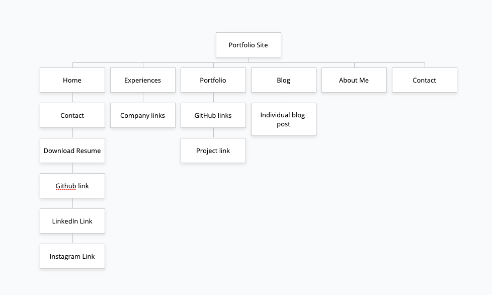

 ## SCREENSHOTS OF DEVELOPMENT PROCESS:

- The first process was to get inspiration for what I want my site to look like. The below are some examples of where I got my inspiration from and how it put my designs into effect. Below are screen shots from my Dribble board.

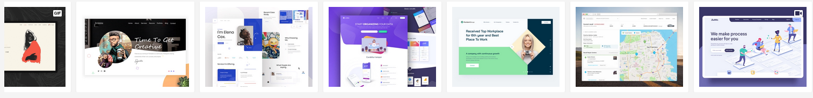

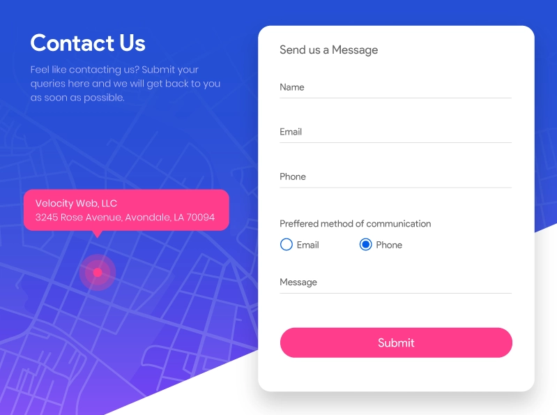

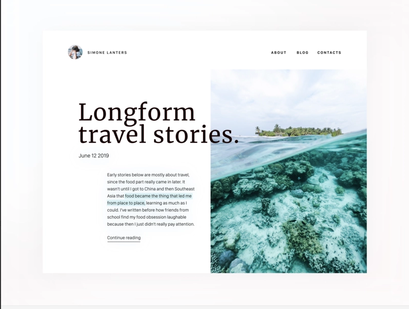

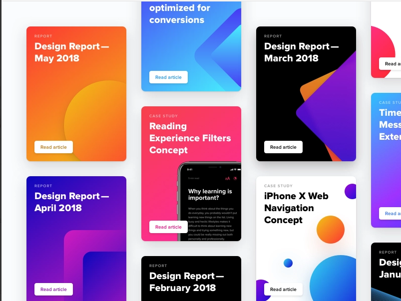

- The next stage was to then do some rough sketches on paper of what I want my site to look like and how I want it to flow. See below for drawings.

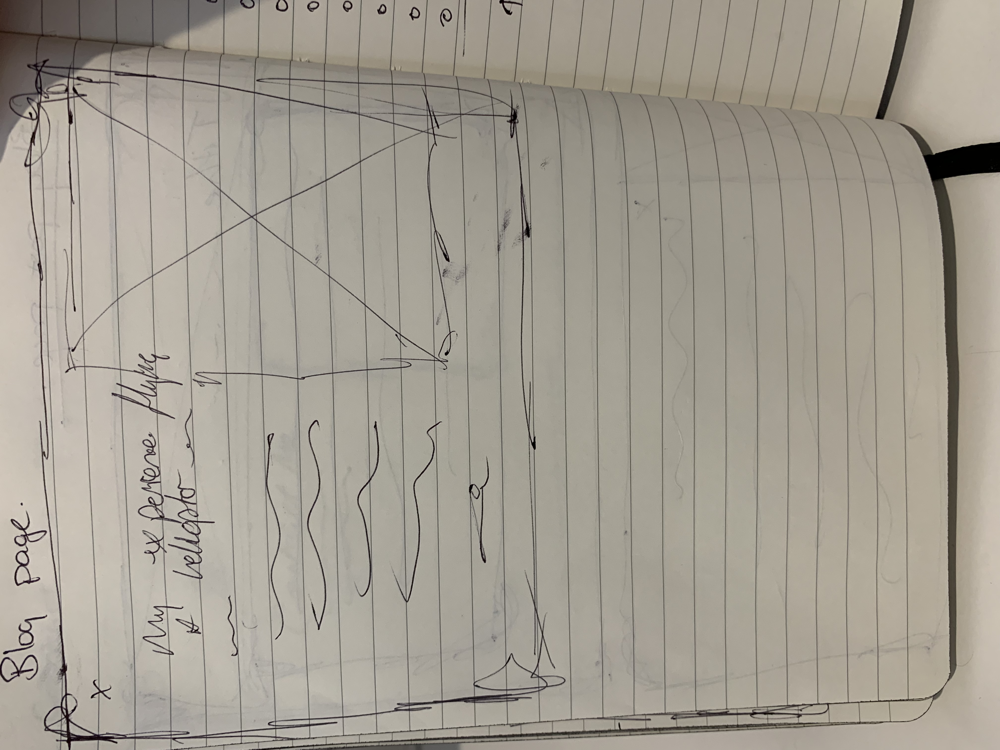

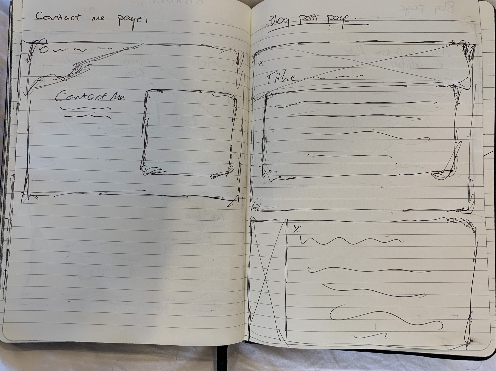

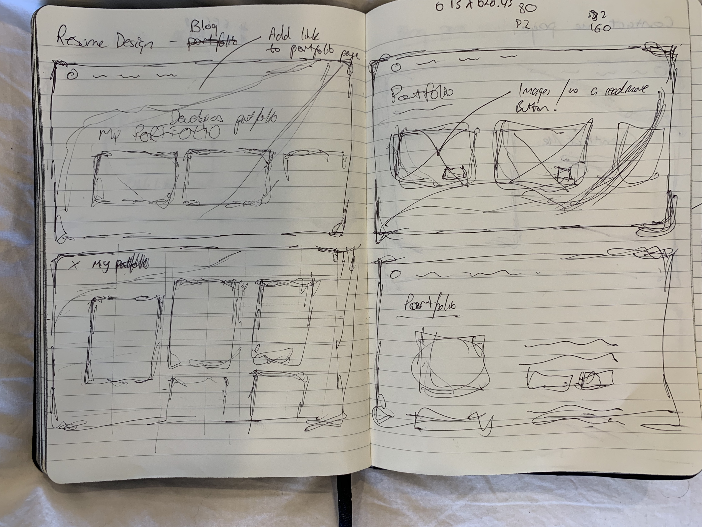

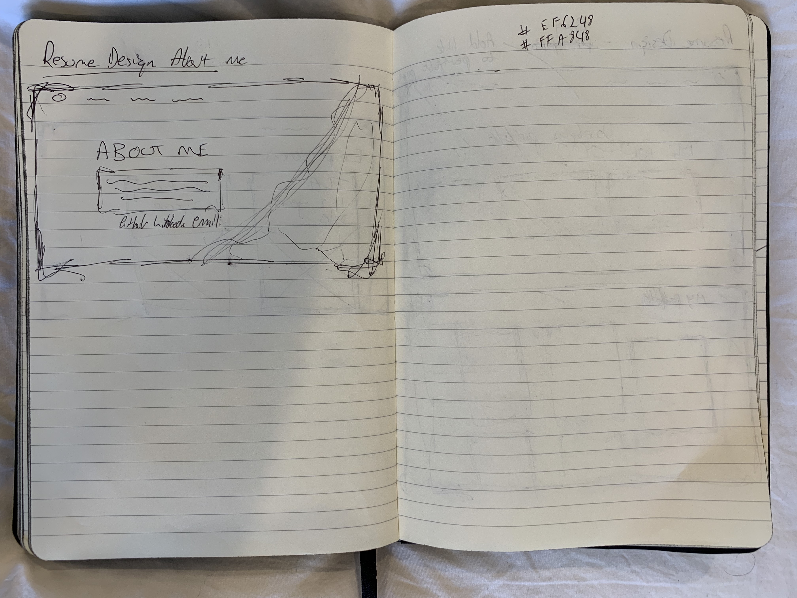

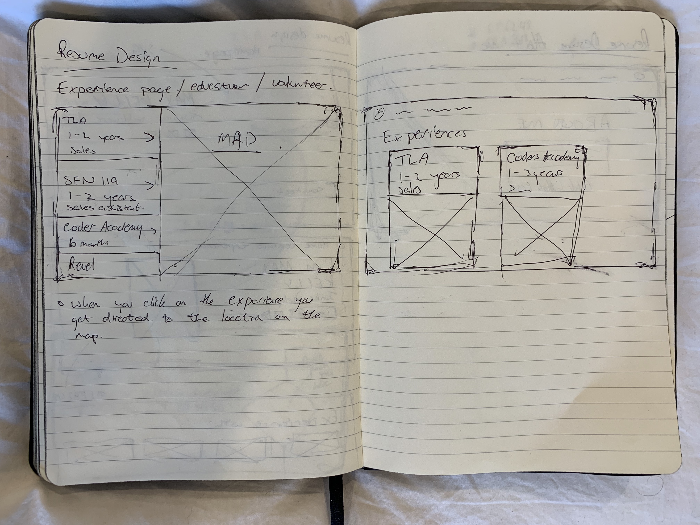

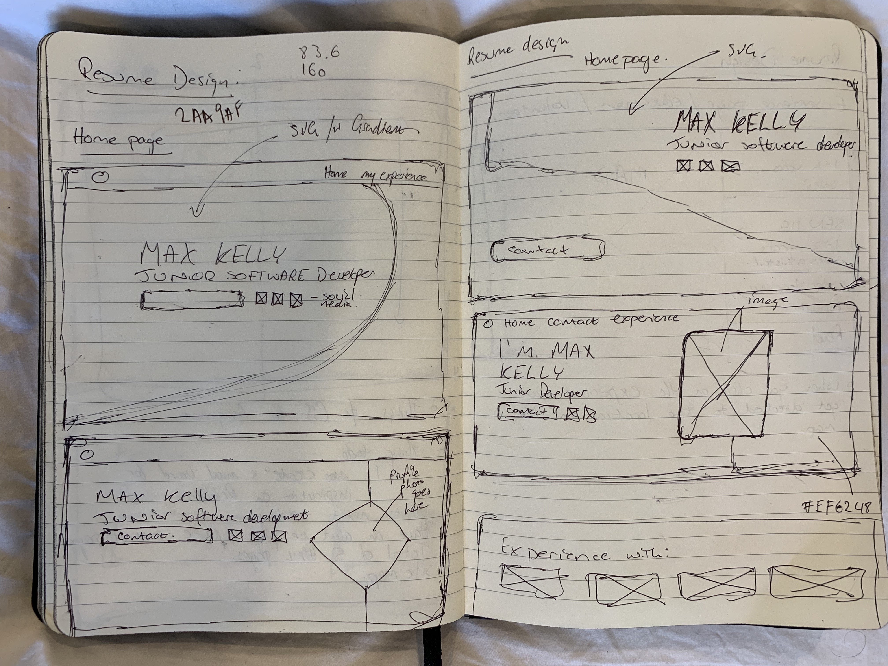

